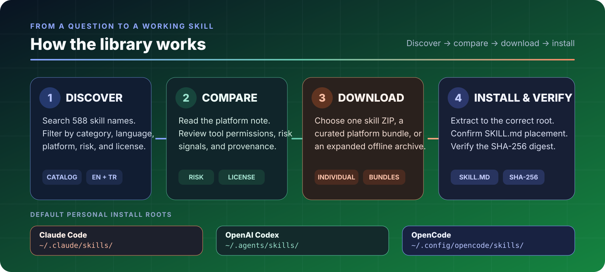

<p align="center">
  <a href="CATALOG.md"><picture><source media="(max-width: 640px)" srcset="assets/library-hero-mobile.svg"></picture></a>
</p>

<p align="center">
  <a href="README.tr.md"><strong>Türkçe</strong></a> ·
  <a href="https://yigityildiz0.github.io/universal-ai-skill-library/">Interactive catalog</a> ·
  <a href="CATALOG.md">Browse all 588</a> ·
  <a href="#download-for-your-agent">Downloads</a> ·
  <a href="INSTALL.md">Installation</a> ·
  <a href="#safety-provenance-and-licenses">Safety &amp; licenses</a>
</p>

<p align="center">
  
  
  
  <a href="https://github.com/yigityildiz0/universal-ai-skill-library/releases/latest"></a>
  <a href="https://github.com/yigityildiz0/universal-ai-skill-library/actions/workflows/validate.yml"></a>
</p>

# Universal AI Skill Library

**One searchable, bilingual library for discovering and installing reusable Agent Skills across Claude Code, OpenAI Codex, and OpenCode.**

An **Agent Skill** is a folder centered on a `SKILL.md` file. It teaches an AI coding agent when and how to perform a repeatable workflow—for example code review, research, testing, data analysis, security checks, design, documentation, or automation. A skill may also include references, templates, scripts, or platform-specific metadata.

This repository gives beginners clear download paths and gives advanced users transparent compatibility, risk, provenance, and package information.

| Unique skill names | Claude Code catalog | OpenAI Codex catalog | OpenCode catalog | Shared across all three |
|---:|---:|---:|---:|---:|
| **588** | **585** | **585** | **588** | **585** |

> These are catalog mappings, not a promise that every dependency or tool was executed successfully on every platform. Read the platform note and inspect a skill before granting permissions.

> **Finance and investing:** the validated 17-skill subset also has a focused repository: [Universal AI Finance Skills](https://github.com/yigityildiz0/universal-ai-finance-skills). It uses calibrated scenarios and risk gates; it does not promise returns.

## Start here

| What do you want to do? | Best starting point | Why |
|---|---|---|
| Find one skill for a specific task | [Search the interactive catalog](https://yigityildiz0.github.io/universal-ai-skill-library/) or [open the full table](CATALOG.md) | Filter by category, platform, risk, and license signal; download only what you need. |
| Install a practical starter library | [Choose a curated platform bundle](#download-for-your-agent) | Installs 151–154 top-level skills plus `skill-library-router` for progressive discovery. |
| Keep a complete offline archive | [Choose an expanded bundle](#curated-vs-expanded) | Includes every catalog entry mapped to that platform. |
| Inspect or automate against the data | Use [catalog.json](manifests/catalog.json) or [catalog.csv](manifests/catalog.csv) | Stable machine-readable fields for descriptions, platforms, risks, licenses, and downloads. |

## Download for your agent

The recommended bundles already contain the correct hidden directory tree. Download the package matching the agent you use, inspect it, and extract it into your home folder or project root.

| Agent | Recommended curated bundle | Expanded archive | Default personal root |
|---|---|---|---|
| **Claude Code** | [⬇ 151 skills · ~15.7 MiB](https://github.com/yigityildiz0/universal-ai-skill-library/releases/latest/download/universal-ai-skill-library-claude.zip) | [⬇ 585 entries](https://github.com/yigityildiz0/universal-ai-skill-library/releases/latest/download/universal-ai-skill-library-claude-expanded.zip) | `~/.claude/skills/` |
| **ChatGPT / OpenAI Codex** | [⬇ 151 skills · ~15.7 MiB](https://github.com/yigityildiz0/universal-ai-skill-library/releases/latest/download/universal-ai-skill-library-codex.zip) | [⬇ 585 entries](https://github.com/yigityildiz0/universal-ai-skill-library/releases/latest/download/universal-ai-skill-library-codex-expanded.zip) | `~/.agents/skills/` |
| **OpenCode** | [⬇ 154 skills · ~15.8 MiB](https://github.com/yigityildiz0/universal-ai-skill-library/releases/latest/download/universal-ai-skill-library-opencode.zip) | [⬇ 588 entries](https://github.com/yigityildiz0/universal-ai-skill-library/releases/latest/download/universal-ai-skill-library-opencode-expanded.zip) | `~/.config/opencode/skills/` |

**New to GitHub?** Use the blue download links above. The green **Code → Download ZIP** button downloads the repository source; it is not the ready-to-install platform bundle.

## How it works

<p align="center"></p>

1. **Discover:** search 588 names by task or category.
2. **Compare:** check the platform note, requested tools, network/API use, destructive patterns, and license signal.
3. **Download:** choose one skill ZIP, a curated platform bundle, or an expanded archive.
4. **Install and verify:** extract to the correct root, confirm the `SKILL.md` layout, and compare the SHA-256 checksum.

## Quick installation

### 1. Choose personal or project scope

| Agent | Personal — macOS/Linux | Personal — Windows | Project-scoped |
|---|---|---|---|
| Claude Code | `~/.claude/skills/` | `%USERPROFILE%\.claude\skills\` | `.claude/skills/` |
| OpenAI Codex | `~/.agents/skills/` | `%USERPROFILE%\.agents\skills\` | `.agents/skills/` |
| OpenCode | `~/.config/opencode/skills/` | `%USERPROFILE%\.config\opencode\skills\` | `.opencode/skills/` |

OpenCode can also discover compatible skills in Claude and Codex skill roots. The OpenCode bundle uses its native `.opencode/skills` layout so each package stays explicit and predictable.

### 2. Check the final folder shape

Every installed skill must have `SKILL.md` directly inside its own folder:

```text
<skills-root>/
└── example-skill/
    ├── SKILL.md
    ├── references/     optional
    ├── scripts/        optional
    └── assets/         optional
```

Avoid accidental double nesting such as `example-skill/example-skill/SKILL.md`.

### 3. Reload and test

Most hosts discover valid skills automatically. If a new skill does not appear, verify the path and YAML frontmatter, then restart the host. Ask naturally or name the skill directly, for example:

```text
Use code-review-and-quality to review this change and prioritize actionable defects.
```

See the [complete installation guide](INSTALL.md) for individual downloads, updates, uninstalling, checksum verification, and troubleshooting.

## Browse by category

| Category | Skills |
|---|---:|
| Specialized integrations | 154 |
| Design, UI, and UX | 75 |
| Coding and architecture | 63 |
| Business and productivity | 42 |
| Documents and data | 41 |
| Agents and context | 40 |
| Testing, debugging, and quality | 40 |
| Security and compliance | 28 |
| Cloud and DevOps | 26 |
| Media and creative | 20 |
| Research and reasoning | 18 |
| Finance and investing | 17 |
| Health and clinical | 15 |
| Science and bioscience | 7 |
| Safety, legal, and decisions | 2 |

Browse through the [interactive English/Turkish catalog](https://yigityildiz0.github.io/universal-ai-skill-library/), the [complete English table](CATALOG.md), or the [Turkish table](CATALOG.tr.md). Every catalog row includes a description, platform note, capability/risk signals, license status, and direct downloads.

## Curated vs expanded

### Curated bundles — recommended

- Keep the initial top-level skill list manageable.
- Include **151 Claude**, **151 Codex**, or **154 OpenCode** skills.
- Include `skill-library-router`, which exposes the embedded catalog progressively instead of flooding the agent's discovery metadata.
- Best for normal daily use.

### Expanded bundles — advanced/offline

- Install every compatible catalog name directly: **585 / 585 / 588**.
- Useful for offline archives, auditing, or custom packaging.
- Can crowd a host's skill-discovery context and make selection noisier.

### Preserved variants

The library keeps **21 conflicting embedded variants** under `skills/archive-variants/` instead of silently merging or overwriting them. These are reviewable archive records, not automatically selected replacements.

## Safety, provenance, and licenses

Skills are instructions and may reference scripts, package installation, external APIs, credentials, privileged operations, or destructive commands. Before use:

- Read `SKILL.md` and any scripts or referenced files.
- Review required tools, dependencies, network access, and external services.
- Keep secrets, private code, and sensitive data out of untrusted services.
- Require explicit confirmation before installation, deletion, publication, purchases, or privileged changes.
- Test high-impact skills in an isolated project or disposable environment.

**License scope matters:** **405 catalog entries have no local redistribution-license signal.** The repository's [LICENSE.md](LICENSE.md) covers repository-authored catalog metadata, documentation, website, and packaging code—not all third-party skill bodies. Each skill retains its own upstream terms. Read [THIRD_PARTY_NOTICES.md](THIRD_PARTY_NOTICES.md) and [PUBLISHING.md](PUBLISHING.md) before reuse or redistribution.

To verify a downloaded file on Windows:

```powershell
Get-FileHash .\universal-ai-skill-library-codex.zip -Algorithm SHA256
```

On macOS/Linux:

```bash
sha256sum universal-ai-skill-library-codex.zip
```

Compare the result with [manifests/SHA256SUMS.txt](manifests/SHA256SUMS.txt).

## Repository architecture

```text
skills/common/                 portable common core
skills/platforms/codex/        Codex metadata overlays or Codex-only skills
skills/platforms/opencode/     OpenCode-only skills
skills/archive-variants/       preserved conflicting embedded versions
packages/common/               individual portable ZIP files
packages/<platform>/           platform-specific individual ZIP files
release-assets/                curated and expanded release bundles
manifests/                     JSON, CSV, checksums, and repository metadata
docs/                          bilingual searchable static catalog
```

The source catalog's `hosts` field is treated as a mapping signal—not runtime proof. Platform-specific behavior is kept visible rather than silently flattened into one file.

## Documentation map

| Document | Purpose |
|---|---|
| [Interactive catalog](https://yigityildiz0.github.io/universal-ai-skill-library/) | Search and filter without cloning the repository. |
| [CATALOG.md](CATALOG.md) / [CATALOG.tr.md](CATALOG.tr.md) | Complete human-readable tables with per-skill downloads. |
| [INSTALL.md](INSTALL.md) / [INSTALL.tr.md](INSTALL.tr.md) | Beginner installation, update, uninstall, and troubleshooting steps. |
| [catalog.json](manifests/catalog.json) / [catalog.csv](manifests/catalog.csv) | Machine-readable catalog data. |
| [SECURITY.md](SECURITY.md) | Security reporting and safe-use guidance. |
| [THIRD_PARTY_NOTICES.md](THIRD_PARTY_NOTICES.md) | Per-package license and provenance signals. |
| [CONTRIBUTING.md](CONTRIBUTING.md) | Contribution requirements. |

## FAQ

<details>
<summary><strong>Do all 588 skills work identically on all three agents?</strong></summary>

No. There are 588 unique names; 585 map to Claude Code, 585 to Codex, and 588 to OpenCode. Format compatibility does not prove that every dependency, external service, or platform-specific behavior was executed successfully. Read the catalog note for the skill.
</details>

<details>
<summary><strong>Should I install the curated or expanded bundle?</strong></summary>

Start with the curated bundle. Use expanded only when you intentionally need a complete offline archive or plan to audit/repackage the collection.
</details>

<details>
<summary><strong>Why is my skill not visible?</strong></summary>

The most common causes are the wrong root folder, double nesting, a lowercase or missing `SKILL.md`, invalid YAML frontmatter, or a host that needs restarting after its skill root was first created. Follow [INSTALL.md](INSTALL.md#troubleshooting).
</details>

<details>
<summary><strong>Is every skill covered by MIT?</strong></summary>

No. The repository-authored catalog and packaging layer use the scope described in [LICENSE.md](LICENSE.md). Third-party skill bodies keep their own terms, and an unspecified signal is not an open-source grant.
</details>

## Contributing and support

- Improvements and provenance corrections: [open an issue](https://github.com/yigityildiz0/universal-ai-skill-library/issues) or read [CONTRIBUTING.md](CONTRIBUTING.md).
- Security concerns: follow [SECURITY.md](SECURITY.md); do not publish sensitive exploit details in a public issue.
- Rights or takedown requests: provide the affected path, ownership evidence, and requested action.

If this library saves you time, star the repository so more builders can discover it.
