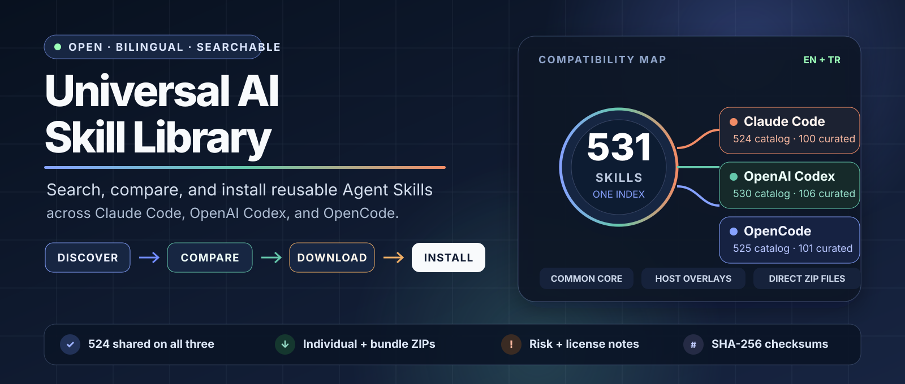
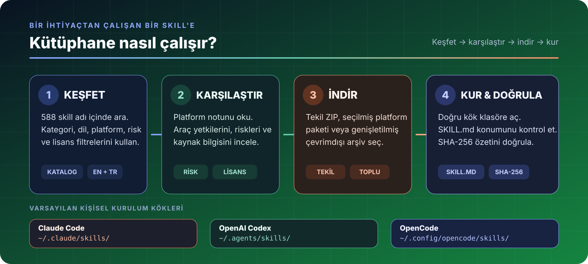

<p align="center">
  <a href="CATALOG.tr.md"><picture><source media="(max-width: 640px)" srcset="assets/library-hero-mobile.svg"></picture></a>
</p>

<p align="center">
  <a href="README.md"><strong>English</strong></a> ·
  <a href="https://yigityildiz0.github.io/universal-ai-skill-library/">Etkileşimli katalog</a> ·
  <a href="CATALOG.tr.md">531 skill’in tamamı</a> ·
  <a href="#agentına-uygun-paketi-indir">İndirmeler</a> ·
  <a href="INSTALL.tr.md">Kurulum</a> ·
  <a href="#güvenlik-kaynak-ve-lisanslar">Güvenlik ve lisanslar</a>
</p>

<p align="center">
  
  
  
  <a href="https://github.com/yigityildiz0/universal-ai-skill-library/releases/latest"></a>
  <a href="https://github.com/yigityildiz0/universal-ai-skill-library/actions/workflows/validate.yml"></a>
</p>

# Universal AI Skill Library

**Claude Code, OpenAI Codex ve OpenCode üzerinde tekrar kullanılabilir Agent Skill’leri bulmak ve kurmak için aranabilir, iki dilli tek kütüphane.**

**Agent Skill**, merkezinde `SKILL.md` bulunan bir klasördür. Yapay zekâ kodlama ajanına kod inceleme, araştırma, test, veri analizi, güvenlik kontrolü, tasarım, dokümantasyon veya otomasyon gibi tekrar eden bir işi ne zaman ve nasıl yapacağını öğretir. Bir skill; referans, şablon, script veya platforma özel metadata da içerebilir.

Bu repo, yeni başlayanlara net indirme yolları; ileri düzey kullanıcılara ise açık uyumluluk, risk, kaynak ve paket bilgileri sunar.

| Benzersiz skill adı | Claude Code kataloğu | OpenAI Codex kataloğu | OpenCode kataloğu | Üçünde ortak |
|---:|---:|---:|---:|---:|
| **531** | **524** | **530** | **525** | **524** |

> Bu sayılar katalog eşlemesidir; her bağımlılığın veya aracın her platformda başarıyla çalıştırıldığı garantisi değildir. Yetki vermeden önce platform notunu ve skill içeriğini incele.

## Buradan başla

| Ne yapmak istiyorsun? | En doğru başlangıç | Neden? |
|---|---|---|
| Belirli bir iş için tek skill bulmak | [Etkileşimli katalogda ara](https://yigityildiz0.github.io/universal-ai-skill-library/) veya [tam tabloyu aç](CATALOG.tr.md) | Kategori, platform, risk ve lisans sinyaline göre filtrele; yalnız ihtiyacını indir. |
| Pratik bir başlangıç kütüphanesi kurmak | [Platformuna uygun seçilmiş paketi indir](#agentına-uygun-paketi-indir) | 100–106 üst seviye skill ve aşamalı keşif için `skill-library-router` içerir. |
| Tam çevrimdışı arşiv tutmak | [Genişletilmiş paket seç](#seçilmiş-paket-mi-genişletilmiş-paket-mi) | O platforma eşlenen bütün katalog adlarını içerir. |
| Veriyi script veya araçlarla kullanmak | [catalog.json](manifests/catalog.json) veya [catalog.csv](manifests/catalog.csv) | Açıklama, platform, risk, lisans ve indirme alanlarını makine-okur biçimde sunar. |

## Agentına uygun paketi indir

Önerilen paketler doğru gizli klasör ağacını hazır içerir. Kullandığın agenta uygun paketi indir, içeriğini incele ve kullanıcı ana klasörüne veya proje köküne aç.

| Agent | Önerilen seçilmiş paket | Genişletilmiş arşiv | Varsayılan kişisel kök |
|---|---|---|---|
| **Claude Code** | [⬇ 100 skill · ~15,1 MiB](https://github.com/yigityildiz0/universal-ai-skill-library/releases/latest/download/universal-ai-skill-library-claude.zip) | [⬇ 524 kayıt · ~28,4 MiB](https://github.com/yigityildiz0/universal-ai-skill-library/releases/latest/download/universal-ai-skill-library-claude-expanded.zip) | `~/.claude/skills/` |
| **OpenAI Codex** | [⬇ 106 skill · ~15,2 MiB](https://github.com/yigityildiz0/universal-ai-skill-library/releases/latest/download/universal-ai-skill-library-codex.zip) | [⬇ 530 kayıt · ~28,6 MiB](https://github.com/yigityildiz0/universal-ai-skill-library/releases/latest/download/universal-ai-skill-library-codex-expanded.zip) | `~/.agents/skills/` |
| **OpenCode** | [⬇ 101 skill · ~15,1 MiB](https://github.com/yigityildiz0/universal-ai-skill-library/releases/latest/download/universal-ai-skill-library-opencode.zip) | [⬇ 525 kayıt · ~28,5 MiB](https://github.com/yigityildiz0/universal-ai-skill-library/releases/latest/download/universal-ai-skill-library-opencode-expanded.zip) | `~/.config/opencode/skills/` |

**GitHub’ı ilk kez mi kullanıyorsun?** Yukarıdaki mavi indirme bağlantılarını kullan. Yeşil **Code → Download ZIP** düğmesi repo kaynak kodunu indirir; kuruluma hazır platform paketi değildir.

## Nasıl çalışır?

<p align="center"></p>

1. **Keşfet:** 531 ad içinde göreve veya kategoriye göre ara.
2. **Karşılaştır:** platform notunu, istenen araçları, ağ/API kullanımını, yıkıcı kalıpları ve lisans sinyalini kontrol et.
3. **İndir:** tek skill ZIP’i, seçilmiş platform paketi veya genişletilmiş arşiv seç.
4. **Kur ve doğrula:** doğru kök klasöre aç, `SKILL.md` yapısını ve SHA-256 özetini doğrula.

## Hızlı kurulum

### 1. Kişisel veya proje kapsamını seç

| Agent | Kişisel — macOS/Linux | Kişisel — Windows | Proje kapsamı |
|---|---|---|---|
| Claude Code | `~/.claude/skills/` | `%USERPROFILE%\.claude\skills\` | `.claude/skills/` |
| OpenAI Codex | `~/.agents/skills/` | `%USERPROFILE%\.agents\skills\` | `.agents/skills/` |
| OpenCode | `~/.config/opencode/skills/` | `%USERPROFILE%\.config\opencode\skills\` | `.opencode/skills/` |

OpenCode, uyumlu skill’leri Claude ve Codex skill köklerinde de bulabilir. OpenCode paketi, kurulumun açık ve öngörülebilir kalması için kendi `.opencode/skills` yapısını kullanır.

### 2. Son klasör yapısını kontrol et

Her kurulu skill’in kendi klasöründe doğrudan `SKILL.md` bulunmalıdır:

```text
<skills-root>/
└── örnek-skill/
    ├── SKILL.md
    ├── references/     isteğe bağlı
    ├── scripts/        isteğe bağlı
    └── assets/         isteğe bağlı
```

`örnek-skill/örnek-skill/SKILL.md` gibi yanlış çift klasör oluşmamasına dikkat et.

### 3. Yeniden yükle ve dene

Geçerli skill’ler çoğu host tarafından otomatik bulunur. Görünmüyorsa yolu ve YAML frontmatter’ı kontrol et, ardından host’u yeniden başlat. Doğal dille isteyebilir veya skill adını doğrudan söyleyebilirsin:

```text
code-review-and-quality kullan; bu değişikliği incele ve uygulanabilir hataları önceliklendir.
```

Tekil indirme, güncelleme, kaldırma, checksum ve hata çözümü için [ayrıntılı kurulum rehberine](INSTALL.tr.md) bak.

## Kategoriye göre göz at

| Kategori | Skill | Kategori | Skill |
|---|---:|---|---:|
| Özel entegrasyonlar | 143 | Tasarım, UI ve UX | 75 |
| Kodlama ve mimari | 63 | İş ve üretkenlik | 42 |
| Test, hata ayıklama ve kalite | 40 | Belge ve veri | 35 |
| Agent ve bağlam | 33 | Güvenlik ve uyumluluk | 29 |
| Bulut ve DevOps | 26 | Medya ve yaratıcı işler | 20 |
| Araştırma ve akıl yürütme | 18 | Bilim ve biyobilim | 7 |

[İngilizce/Türkçe etkileşimli katalog](https://yigityildiz0.github.io/universal-ai-skill-library/), [tam Türkçe tablo](CATALOG.tr.md) veya [İngilizce tablo](CATALOG.md) üzerinden gezinebilirsin. Her satır; açıklama, platform notu, yetenek/risk sinyali, lisans durumu ve doğrudan indirme bağlantıları içerir.

## Seçilmiş paket mi, genişletilmiş paket mi?

### Seçilmiş paketler — önerilen

- İlk üst seviye skill listesini yönetilebilir tutar.
- **100 Claude**, **106 Codex** veya **101 OpenCode** skill’i içerir.
- Agentın keşif metadata’sını yüzlerce kayıtla doldurmak yerine gömülü kataloğu gerektiğinde açan `skill-library-router` içerir.
- Günlük kullanım için en doğru seçimdir.

### Genişletilmiş paketler — ileri düzey/çevrimdışı

- Uyumlu bütün katalog adlarını doğrudan kurar: **524 / 530 / 525**.
- Çevrimdışı arşiv, denetim veya özel paketleme için yararlıdır.
- Host’un skill keşif bağlamını doldurabilir ve seçimi gürültülü hâle getirebilir.

### Korunan varyantlar

Kütüphane, **21 çakışan gömülü varyantı** sessizce birleştirmek veya üstüne yazmak yerine `skills/archive-variants/` altında korur. Bunlar incelenebilir arşiv kayıtlarıdır; otomatik seçilen yedekler değildir.

## Güvenlik, kaynak ve lisanslar

Skill’ler talimattır; script, paket kurulumu, harici API, kimlik bilgisi, yönetici işlemi veya yıkıcı komut içerebilir. Kullanmadan önce:

- `SKILL.md`, script ve referans dosyalarını oku.
- İstenen araçları, bağımlılıkları, ağ erişimini ve harici servisleri incele.
- Gizli anahtarları, özel kodu ve hassas veriyi güvenilmeyen servislere gönderme.
- Kurulum, silme, yayınlama, satın alma veya yönetici değişikliği öncesinde açık onay iste.
- Etkisi yüksek skill’leri izole proje veya geçici ortamda dene.

**Lisans kapsamı önemlidir:** **405 katalog kaydında yerel yeniden dağıtım lisansı sinyali yoktur.** Reponun [LICENSE.md](LICENSE.md) dosyası repo tarafından üretilen katalog metadata’sını, dokümanları, siteyi ve paketleme kodunu kapsar; bütün üçüncü taraf skill içeriklerini kapsamaz. Her skill kendi upstream koşullarını korur. Yeniden kullanmadan veya dağıtmadan önce [THIRD_PARTY_NOTICES.md](THIRD_PARTY_NOTICES.md) ve [PUBLISHING.md](PUBLISHING.md) dosyalarını oku.

Windows’ta indirmeyi doğrulamak için:

```powershell
Get-FileHash .\universal-ai-skill-library-codex.zip -Algorithm SHA256
```

macOS/Linux’ta:

```bash
sha256sum universal-ai-skill-library-codex.zip
```

Sonucu [manifests/SHA256SUMS.txt](manifests/SHA256SUMS.txt) ile karşılaştır.

## Repo mimarisi

```text
skills/common/                 taşınabilir ortak çekirdek
skills/platforms/codex/        Codex metadata katmanları veya yalnız Codex skill’leri
skills/platforms/opencode/     yalnız OpenCode skill’leri
skills/archive-variants/       korunan çakışan gömülü sürümler
packages/common/               tekil taşınabilir ZIP dosyaları
packages/<platform>/           platforma özel tekil ZIP dosyaları
release-assets/                seçilmiş ve genişletilmiş toplu paketler
manifests/                     JSON, CSV, checksum ve repo metadata’sı
docs/                          iki dilli aranabilir statik katalog
```

Kaynak katalogdaki `hosts` alanı çalışma garantisi değil, eşleme sinyali olarak değerlendirilir. Platforma özel davranışlar sessizce tek dosyada düzleştirilmez; görünür tutulur.

## Doküman haritası

| Doküman | Ne işe yarar? |
|---|---|
| [Etkileşimli katalog](https://yigityildiz0.github.io/universal-ai-skill-library/) | Repoyu klonlamadan arama ve filtreleme. |
| [CATALOG.tr.md](CATALOG.tr.md) / [CATALOG.md](CATALOG.md) | Skill başına indirme içeren tam tablolar. |
| [INSTALL.tr.md](INSTALL.tr.md) / [INSTALL.md](INSTALL.md) | Başlangıç kurulumu, güncelleme, kaldırma ve hata çözümü. |
| [catalog.json](manifests/catalog.json) / [catalog.csv](manifests/catalog.csv) | Makine-okur katalog verisi. |
| [SECURITY.md](SECURITY.md) | Güvenlik bildirimi ve güvenli kullanım. |
| [THIRD_PARTY_NOTICES.md](THIRD_PARTY_NOTICES.md) | Paket bazında lisans ve kaynak sinyalleri. |
| [CONTRIBUTING.md](CONTRIBUTING.md) | Katkı kuralları. |

## Sık sorulan sorular

<details>
<summary><strong>531 skill’in tamamı üç agentta aynı mı çalışır?</strong></summary>

Hayır. 531 benzersiz ad vardır; 524’ü Claude Code’a, 530’u Codex’e, 525’i OpenCode’a eşlenir. Biçim uyumluluğu; her bağımlılık, dış servis veya platforma özel davranışın başarıyla çalıştırıldığını kanıtlamaz. Skill’in katalog notunu oku.
</details>

<details>
<summary><strong>Seçilmiş mi yoksa genişletilmiş paket mi kurmalıyım?</strong></summary>

Seçilmiş paketle başla. Genişletilmiş paketi yalnız tam çevrimdışı arşive gerçekten ihtiyacın varsa veya koleksiyonu denetleyip yeniden paketleyeceksen kullan.
</details>

<details>
<summary><strong>Skill neden görünmüyor?</strong></summary>

En yaygın nedenler yanlış kök klasör, çift klasör, küçük harfli veya eksik `SKILL.md`, geçersiz YAML frontmatter ya da skill kökü ilk kez oluşturulduktan sonra host’un yeniden başlatılmamış olmasıdır. [INSTALL.tr.md](INSTALL.tr.md#hata-çözümü) adımlarını uygula.
</details>

<details>
<summary><strong>Her skill MIT lisanslı mı?</strong></summary>

Hayır. Repo tarafından üretilen katalog ve paketleme katmanının kapsamı [LICENSE.md](LICENSE.md) içinde açıklanır. Üçüncü taraf skill içerikleri kendi koşullarını korur; “belirsiz” lisans sinyali açık kaynak izni değildir.
</details>

## Katkı ve destek

- İyileştirme veya kaynak düzeltmesi için [issue aç](https://github.com/yigityildiz0/universal-ai-skill-library/issues) ya da [CONTRIBUTING.md](CONTRIBUTING.md) dosyasını oku.
- Güvenlik sorunlarında [SECURITY.md](SECURITY.md) yolunu kullan; hassas açık ayrıntılarını herkese açık issue’da paylaşma.
- Hak sahipliği veya kaldırma talebinde etkilenen yolu, sahiplik kanıtını ve istenen işlemi belirt.

Bu kütüphane zaman kazandırdıysa daha fazla geliştiricinin keşfetmesi için repoya yıldız verebilirsin.
