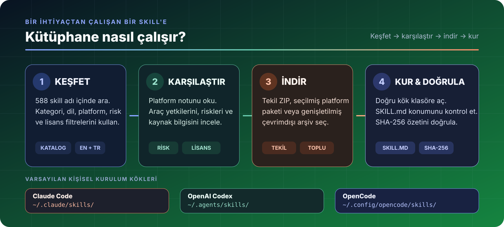

<!-- GENERAL-DOWNLOADS -->
**Yalnızca 12 genel skill:** [ChatGPT ZIP](https://github.com/yigityildiz0/universal-ai-skill-library/raw/refs/heads/main/downloads/General-ChatGPT.zip) · [Claude ZIP](https://github.com/yigityildiz0/universal-ai-skill-library/raw/refs/heads/main/downloads/General-Claude.zip)
<!-- END-GENERAL-DOWNLOADS -->

<!-- CURRENT-SKILL-PUBLICATION -->


# Universal AI Skill Library

35 skill: kaynak araştırma, araç seçimi ve doğrulanabilir sonuç üretme için hazır iş akışları. Modelin ağırlıklarını değiştirmez; sonuç kalitesi kullanılan kaynaklara ve araçlara bağlıdır.

[](https://github.com/yigityildiz0/universal-ai-skill-library/raw/refs/heads/main/downloads/ChatGPT.zip) [](https://github.com/yigityildiz0/universal-ai-skill-library/raw/refs/heads/main/downloads/Claude.zip)

**ChatGPT:** bütün listelenen skilleri içeren eklenti paketini indir; hesabının desteklediği kişisel eklenti/skill içe aktarma akışını kullan. Tek-skill ChatGPT bağlantısı, tek skill içeren eklenti ZIP’idir. **Claude:** toplu ZIP’i aç, içindeki tekil skill ZIP’lerini ayrı ayrı yükle. Dış ZIP tek bir Claude skill’i değildir. Yerel kurulum bulut hesabına yükleme yapmaz.

Türkçe veya İngilizce doğal isteklerle kullan: “literatür tara / search literature”, “makale değerlendir / appraise paper”, “fizyo vakasını analiz et / assess physio case”. Kısa kelimeler seçim ipuçlarıdır; bütün platformlarda aynı slash menüsünü oluşturmaz. Mevcut iş akışları ve güvenlik kuralları korunmuştur.

## Skill listesi

| Skill | Çözdüğü sorun / örnek istek | ChatGPT | Claude |
|---|---|---|---|
| [`academic-study-coach`](skills/common/academic-study-coach/SKILL.md) | Bir konuyu öğret; makaleyi açıkla; sınava hazırla | [↓ ZIP](packages/chatgpt/academic-study-coach.zip) | [↓ ZIP](packages/claude/academic-study-coach.zip) |
| [`ai-agent-builder`](skills/common/ai-agent-builder/SKILL.md) | Skill geliştir; eklentiyi incele; MCP tasarla | [↓ ZIP](packages/chatgpt/ai-agent-builder.zip) | [↓ ZIP](packages/claude/ai-agent-builder.zip) |
| [`ai-image-video-studio`](skills/common/ai-image-video-studio/SKILL.md) | Görsel/video iş akışı kur; ComfyUI hatasını çöz | [↓ ZIP](packages/chatgpt/ai-image-video-studio.zip) | [↓ ZIP](packages/claude/ai-image-video-studio.zip) |
| [`ai-research-skills`](skills/common/ai-research-skills/SKILL.md) | AI araştırma fikri üret; deney veya makale planla | [↓ ZIP](packages/chatgpt/ai-research-skills.zip) | [↓ ZIP](packages/claude/ai-research-skills.zip) |
| [`banner-design`](skills/common/banner-design/SKILL.md) | Banner veya kapak tasarla | [↓ ZIP](packages/chatgpt/banner-design.zip) | [↓ ZIP](packages/claude/banner-design.zip) |
| [`brand`](skills/common/brand/SKILL.md) | Marka kimliği ve iletişim dili oluştur | [↓ ZIP](packages/chatgpt/brand.zip) | [↓ ZIP](packages/claude/brand.zip) |
| [`campaign-plan`](skills/common/campaign-plan/SKILL.md) | Hedef kitle, içerik, bütçe ve ölçüm planla | [↓ ZIP](packages/chatgpt/campaign-plan.zip) | [↓ ZIP](packages/claude/campaign-plan.zip) |
| [`caveman`](skills/common/caveman/SKILL.md) | Caveman modunu aç; normal kısa cevapla karıştırma | [↓ ZIP](packages/chatgpt/caveman.zip) | [↓ ZIP](packages/claude/caveman.zip) |
| [`coding-workflow`](skills/common/coding-workflow/SKILL.md) | Hata çöz; kod incele; değişikliği doğrula | [↓ ZIP](packages/chatgpt/coding-workflow.zip) | [↓ ZIP](packages/claude/coding-workflow.zip) |
| [`context7-mcp`](skills/common/context7-mcp/SKILL.md) | Context7 ile güncel kütüphane belgesini bul | [↓ ZIP](packages/chatgpt/context7-mcp.zip) | [↓ ZIP](packages/claude/context7-mcp.zip) |
| [`data-analyst`](skills/common/data-analyst/SKILL.md) | Tabloyu analiz et; istatistikleri açıkla | [↓ ZIP](packages/chatgpt/data-analyst.zip) | [↓ ZIP](packages/claude/data-analyst.zip) |
| [`design`](skills/common/design/SKILL.md) | Logo, ikon veya görsel tasarla | [↓ ZIP](packages/chatgpt/design.zip) | [↓ ZIP](packages/claude/design.zip) |
| [`design-system`](skills/common/design-system/SKILL.md) | Tasarım tokenları ve bileşen sistemi oluştur | [↓ ZIP](packages/chatgpt/design-system.zip) | [↓ ZIP](packages/claude/design-system.zip) |
| [`find-docs`](skills/common/find-docs/SKILL.md) | Resmi SDK/API/CLI belgesini bul | [↓ ZIP](packages/chatgpt/find-docs.zip) | [↓ ZIP](packages/claude/find-docs.zip) |
| [`gemini-deep-research`](skills/common/gemini-deep-research/SKILL.md) | Gemini ile kaynaklı derin araştır | [↓ ZIP](packages/chatgpt/gemini-deep-research.zip) | [↓ ZIP](packages/claude/gemini-deep-research.zip) |
| [`graphify`](skills/common/graphify/SKILL.md) | Belgeler veya kod arasında bilgi grafiği çıkar | [↓ ZIP](packages/chatgpt/graphify.zip) | [↓ ZIP](packages/claude/graphify.zip) |
| [`medical-evidence-research`](skills/common/medical-evidence-research/SKILL.md) | Literatür tara; makaleyi değerlendir; güncel kanıtı bul | [↓ ZIP](packages/chatgpt/medical-evidence-research.zip) | [↓ ZIP](packages/claude/medical-evidence-research.zip) |
| [`mental-health-crisis-support`](skills/common/mental-health-crisis-support/SKILL.md) | Krizde güvenliği ve uygun insan desteğini öncele | [↓ ZIP](packages/chatgpt/mental-health-crisis-support.zip) | [↓ ZIP](packages/claude/mental-health-crisis-support.zip) |
| [`modern-web-guidance`](skills/common/modern-web-guidance/SKILL.md) | Modern CSS/API uyumluluğunu değerlendir | [↓ ZIP](packages/chatgpt/modern-web-guidance.zip) | [↓ ZIP](packages/claude/modern-web-guidance.zip) |
| [`office-docs-qa`](skills/common/office-docs-qa/SKILL.md) | PDF, Word, Excel veya sunumu kontrol et | [↓ ZIP](packages/chatgpt/office-docs-qa.zip) | [↓ ZIP](packages/claude/office-docs-qa.zip) |
| [`parallel-web`](skills/common/parallel-web/SKILL.md) | Çoklu web kaynağını paralel araştır | [↓ ZIP](packages/chatgpt/parallel-web.zip) | [↓ ZIP](packages/claude/parallel-web.zip) |
| [`personal-tech-copilot`](skills/common/personal-tech-copilot/SKILL.md) | Bilgisayar, telefon veya uygulama sorununu çöz | [↓ ZIP](packages/chatgpt/personal-tech-copilot.zip) | [↓ ZIP](packages/claude/personal-tech-copilot.zip) |
| [`physio-clinical-copilot`](skills/common/physio-clinical-copilot/SKILL.md) | Fizyo vakasını analiz et; rehabilitasyon planla | [↓ ZIP](packages/chatgpt/physio-clinical-copilot.zip) | [↓ ZIP](packages/claude/physio-clinical-copilot.zip) |
| [`plan-smart-routes`](skills/common/plan-smart-routes/SKILL.md) | Nasıl giderim; yürüyüş ve toplu taşıma rotası bul | [↓ ZIP](packages/chatgpt/plan-smart-routes.zip) | [↓ ZIP](packages/claude/plan-smart-routes.zip) |
| [`primary-source-research`](skills/common/primary-source-research/SKILL.md) | Birincil kaynaklardan doğrula; kaynaklı not hazırla | [↓ ZIP](packages/chatgpt/primary-source-research.zip) | [↓ ZIP](packages/claude/primary-source-research.zip) |
| [`purchase-advisor`](skills/common/purchase-advisor/SKILL.md) | Almaya değer mi; ürünleri karşılaştır | [↓ ZIP](packages/chatgpt/purchase-advisor.zip) | [↓ ZIP](packages/claude/purchase-advisor.zip) |
| [`research-analyst`](skills/common/research-analyst/SKILL.md) | Araştır; iddiayı doğrula; karşıt kanıtları incele | [↓ ZIP](packages/chatgpt/research-analyst.zip) | [↓ ZIP](packages/claude/research-analyst.zip) |
| [`site-seo-audit`](skills/common/site-seo-audit/SKILL.md) | SEO denetle; teknik sorunları önceliklendir | [↓ ZIP](packages/chatgpt/site-seo-audit.zip) | [↓ ZIP](packages/claude/site-seo-audit.zip) |
| [`slides`](skills/common/slides/SKILL.md) | Sunum veya HTML slayt hazırla | [↓ ZIP](packages/chatgpt/slides.zip) | [↓ ZIP](packages/claude/slides.zip) |
| [`ui-styling`](skills/common/ui-styling/SKILL.md) | Tailwind/shadcn ile arayüzü düzenle | [↓ ZIP](packages/chatgpt/ui-styling.zip) | [↓ ZIP](packages/claude/ui-styling.zip) |
| [`ui-ux-pro-max`](skills/common/ui-ux-pro-max/SKILL.md) | UI/UX stilini, renkleri ve yazı tiplerini seç | [↓ ZIP](packages/chatgpt/ui-ux-pro-max.zip) | [↓ ZIP](packages/claude/ui-ux-pro-max.zip) |
| [`web-animation`](skills/common/web-animation/SKILL.md) | Web animasyonu veya sayfa geçişi oluştur | [↓ ZIP](packages/chatgpt/web-animation.zip) | [↓ ZIP](packages/claude/web-animation.zip) |
| [`web-ui-design`](skills/common/web-ui-design/SKILL.md) | Arayüz tasarla veya kullanılabilirliği iyileştir | [↓ ZIP](packages/chatgpt/web-ui-design.zip) | [↓ ZIP](packages/claude/web-ui-design.zip) |
| [`yigit-investment-copilot`](skills/common/yigit-investment-copilot/SKILL.md) | Borsa/fon araştır; portföy riskini değerlendir; emir göndermez | [↓ ZIP](packages/chatgpt/yigit-investment-copilot.zip) | [↓ ZIP](packages/claude/yigit-investment-copilot.zip) |
| [`yigit-writer`](skills/common/yigit-writer/SKILL.md) | Mesaj, e-posta veya yazı hazırla/düzelt | [↓ ZIP](packages/chatgpt/yigit-writer.zip) | [↓ ZIP](packages/claude/yigit-writer.zip) |

## Teknik bilgiler

Claude açıklamaları en fazla 200 karakterdir; her skill paketi en fazla 200 dosya içerir. Kaynaklar, yardımcı betikler ve lisanslar paketlenir. `ai-research-skills` için mevcut bulut alt kümesi ile tam yerel kaynak ayrı tutulur; paketlenmemiş modüller bulut paketinin içinde varmış gibi gösterilmez. API anahtarları, ücretli erişim, yerel CLI ve canlı veri bağlantıları paketin parçası değildir. Kontroller paket yapısını ve kaynak eşleşmesini doğrular; hesapta yükleme, klinik doğruluk veya yatırım performansı testi yapıldığı anlamına gelmez. [Bütünlük değerleri](downloads/SHA256SUMS.txt) · [Kaynak ve lisans bilgisi](THIRD_PARTY_NOTICES.md).

Klinik çıktılarda özet/tam metin, çalışma kalitesi/raporlama, istatistiksel anlamlılık/klinik önem ayrılır. Skill bireysel tanı koymaz ve klinisyenin yerini almaz.

Research and education only: no autonomous orders, credential handling or return guarantees. / Araştırma ve eğitim; otomatik emir göndermez, getiri garanti etmez.


[AI research security repair / Güvenlik düzeltmesi](AI-RESEARCH-SECURITY.md): 98 local / 10 cloud modules retained; explicit scope, privacy and permission boundaries.

<!-- END-CURRENT-SKILL-PUBLICATION -->

<p align="center">
  <a href="CATALOG.tr.md"><picture><source media="(max-width: 640px)" srcset="assets/library-hero-mobile.svg"></picture></a>
</p>

<p align="center">
  <a href="README.md"><strong>English</strong></a> ·
  <a href="https://yigityildiz0.github.io/universal-ai-skill-library/">Etkileşimli katalog</a> ·
  <a href="CATALOG.tr.md">609 skill’in tamamı</a> ·
  <a href="#agentına-uygun-paketi-indir">İndirmeler</a> ·
  <a href="INSTALL.tr.md">Kurulum</a> ·
  <a href="#güvenlik-kaynak-ve-lisanslar">Güvenlik ve lisanslar</a>
</p>

<p align="center">
  
  
  
  <a href="https://github.com/yigityildiz0/universal-ai-skill-library/releases/latest"></a>
  <a href="https://github.com/yigityildiz0/universal-ai-skill-library/actions/workflows/validate.yml"></a>
</p>

# Universal AI Skill Library

**Claude Code, OpenAI Codex ve OpenCode üzerinde tekrar kullanılabilir Agent Skill’leri bulmak ve kurmak için aranabilir, iki dilli tek kütüphane.**

**Agent Skill**, merkezinde `SKILL.md` bulunan bir klasördür. Yapay zekâ kodlama ajanına kod inceleme, araştırma, test, veri analizi, güvenlik kontrolü, tasarım, dokümantasyon veya otomasyon gibi tekrar eden bir işi ne zaman ve nasıl yapacağını öğretir. Bir skill; referans, şablon, script veya platforma özel metadata da içerebilir.

Bu repo, yeni başlayanlara net indirme yolları; ileri düzey kullanıcılara ise açık uyumluluk, risk, kaynak ve paket bilgileri sunar.

| Benzersiz skill adı | Claude Code kataloğu | OpenAI Codex kataloğu | OpenCode kataloğu | Üçünde ortak |
|---:|---:|---:|---:|---:|
| **609** | **586** | **586** | **609** | **586** |

> Bu sayılar katalog eşlemesidir; her bağımlılığın veya aracın her platformda başarıyla çalıştırıldığı garantisi değildir. Yetki vermeden önce platform notunu ve skill içeriğini incele.

> **Finans ve yatırım:** doğrulanmış 17 becerilik alt kümenin odaklı deposu da vardır: [Universal AI Finance Skills](https://github.com/yigityildiz0/universal-ai-finance-skills). Kalibre edilmiş senaryolar ve risk kapıları kullanır; getiri garantisi vermez.

## Klinik literatür güncellemesi — Ekim 2026

[`medical-evidence-research`](skills/common/medical-evidence-research/SKILL.md), PubMed/PEDro ve tamamlayıcı kaynaklarda tekrar üretilebilir tarama, makale değerlendirme, yasal tam metin, kanıt güncellemesi ve yayın hazırlığı yapar. [`physio-clinical-copilot`](skills/common/physio-clinical-copilot/SKILL.md), hasta vakası, rehabilitasyon planı, ölçek, eğitim ve klinik kaydı birleştirir. Doğal biçimde iste: “Bel ağrısında egzersiz literatürünü tara; sorguları, etki/yanlılık değerlendirmesini ve erişim sınırlarını göster.”

| Skill | GPT / Codex | Claude | Taşınabilir / OpenCode |
|---|---|---|---|
| `medical-evidence-research` | [ZIP](packages/codex/medical-evidence-research.zip) | [ZIP](packages/claude/medical-evidence-research.zip) | [ZIP](packages/common/medical-evidence-research.zip) |
| `physio-clinical-copilot` | [ZIP](packages/codex/physio-clinical-copilot.zip) | [ZIP](packages/claude/physio-clinical-copilot.zip) | [ZIP](packages/common/physio-clinical-copilot.zip) |

Eski araştırma/tarama/değerlendirme eşdeğerlerini aynı anda kurmak yerine bu iki birleşik iş akışını kullan. Eski adlar, güncel bağımsız yöntem ve güvenlik fallback’leriyle korunur. Yayın platformu, atıf metriği, AI özeti veya veritabanı puanı tek başına çalışma kalitesi değildir.

Claude.ai özel skill yüklemesinde `<ad>/SKILL.md` içeren tek-skill ZIP kullan; iki skill’i ayrı yükle. Yerel GPT/Codex skill’leri platform ZIP’lerini kullanır. ChatGPT web/mobil için ayrı plugin arşivi ve hostun desteklediği içe aktarma yolu gerekir; yerel ZIP, bulut hesabına kurulum kanıtı değildir. Özellik ve araç erişimi host/hesaba göre değişir. [Kurulum notlarına](INSTALL.tr.md#klinik-literatür-paketleri) bak.

Aşağıdaki `releases/latest` paketleri önceki sürümün snapshot’larıdır. Güncel kaynak ve tek-skill literatür ZIP’leri bu güncellemeyi içerir; eski release paketlerinin veya bulut hesaplarının yenilendiği iddia edilmez.

## Buradan başla

| Ne yapmak istiyorsun? | En doğru başlangıç | Neden? |
|---|---|---|
| Belirli bir iş için tek skill bulmak | [Etkileşimli katalogda ara](https://yigityildiz0.github.io/universal-ai-skill-library/) veya [tam tabloyu aç](CATALOG.tr.md) | Kategori, platform, risk ve lisans sinyaline göre filtrele; yalnız ihtiyacını indir. |
| Pratik bir başlangıç kütüphanesi kurmak | [Platformuna uygun seçilmiş paketi indir](#agentına-uygun-paketi-indir) | 151–154 üst seviye skill ve aşamalı keşif için `skill-library-router` içerir. |
| Tam çevrimdışı arşiv tutmak | [Genişletilmiş paket seç](#seçilmiş-paket-mi-genişletilmiş-paket-mi) | O release’in katalog snapshot’ını içerir; güncellemeler için güncel tek-skill ZIP’lerini kullan. |
| Veriyi script veya araçlarla kullanmak | [catalog.json](manifests/catalog.json) veya [catalog.csv](manifests/catalog.csv) | Açıklama, platform, risk, lisans ve indirme alanlarını makine-okur biçimde sunar. |

## Agentına uygun paketi indir

Önerilen paketler doğru gizli klasör ağacını hazır içerir. Kullandığın agenta uygun paketi indir, içeriğini incele ve kullanıcı ana klasörüne veya proje köküne aç.

| Agent | Önerilen seçilmiş paket | Genişletilmiş arşiv | Varsayılan kişisel kök |
|---|---|---|---|
| **Claude Code** | [⬇ 151 skill · ~15.7 MiB](https://github.com/yigityildiz0/universal-ai-skill-library/releases/latest/download/universal-ai-skill-library-claude.zip) | [⬇ 585 kayıt](https://github.com/yigityildiz0/universal-ai-skill-library/releases/latest/download/universal-ai-skill-library-claude-expanded.zip) | `~/.claude/skills/` |
| **ChatGPT / OpenAI Codex** | [⬇ 151 skill · ~15.7 MiB](https://github.com/yigityildiz0/universal-ai-skill-library/releases/latest/download/universal-ai-skill-library-codex.zip) | [⬇ 585 kayıt](https://github.com/yigityildiz0/universal-ai-skill-library/releases/latest/download/universal-ai-skill-library-codex-expanded.zip) | `~/.agents/skills/` |
| **OpenCode** | [⬇ 154 skill · ~15.8 MiB](https://github.com/yigityildiz0/universal-ai-skill-library/releases/latest/download/universal-ai-skill-library-opencode.zip) | [⬇ 588 kayıt](https://github.com/yigityildiz0/universal-ai-skill-library/releases/latest/download/universal-ai-skill-library-opencode-expanded.zip) | `~/.config/opencode/skills/` |

**GitHub’ı ilk kez mi kullanıyorsun?** Yukarıdaki mavi indirme bağlantılarını kullan. Yeşil **Code → Download ZIP** düğmesi repo kaynak kodunu indirir; kuruluma hazır platform paketi değildir.

## Nasıl çalışır?

<p align="center"></p>

1. **Keşfet:** 609 ad içinde göreve veya kategoriye göre ara.
2. **Karşılaştır:** platform notunu, istenen araçları, ağ/API kullanımını, yıkıcı kalıpları ve lisans sinyalini kontrol et.
3. **İndir:** tek skill ZIP’i, seçilmiş platform paketi veya genişletilmiş arşiv seç.
4. **Kur ve doğrula:** doğru kök klasöre aç, `SKILL.md` yapısını ve SHA-256 özetini doğrula.

## Hızlı kurulum

### 1. Kişisel veya proje kapsamını seç

| Agent | Kişisel — macOS/Linux | Kişisel — Windows | Proje kapsamı |
|---|---|---|---|
| Claude Code | `~/.claude/skills/` | `%USERPROFILE%\.claude\skills\` | `.claude/skills/` |
| OpenAI Codex | `~/.agents/skills/` | `%USERPROFILE%\.agents\skills\` | `.agents/skills/` |
| OpenCode | `~/.config/opencode/skills/` | `%USERPROFILE%\.config\opencode\skills\` | `.opencode/skills/` |

OpenCode, uyumlu skill’leri Claude ve Codex skill köklerinde de bulabilir. OpenCode paketi, kurulumun açık ve öngörülebilir kalması için kendi `.opencode/skills` yapısını kullanır.

### 2. Son klasör yapısını kontrol et

Her kurulu skill’in kendi klasöründe doğrudan `SKILL.md` bulunmalıdır:

```text
<skills-root>/
└── örnek-skill/
    ├── SKILL.md
    ├── references/     isteğe bağlı
    ├── scripts/        isteğe bağlı
    └── assets/         isteğe bağlı
```

`örnek-skill/örnek-skill/SKILL.md` gibi yanlış çift klasör oluşmamasına dikkat et.

### 3. Yeniden yükle ve dene

Geçerli skill’ler çoğu host tarafından otomatik bulunur. Görünmüyorsa yolu ve YAML frontmatter’ı kontrol et, ardından host’u yeniden başlat. Doğal dille isteyebilir veya skill adını doğrudan söyleyebilirsin:

```text
code-review-and-quality kullan; bu değişikliği incele ve uygulanabilir hataları önceliklendir.
```

Tekil indirme, güncelleme, kaldırma, checksum ve hata çözümü için [ayrıntılı kurulum rehberine](INSTALL.tr.md) bak.

## Kategoriye göre göz at

| Kategori | Skill |
|---|---:|
| Özel entegrasyonlar | 154 |
| Tasarım, UI ve UX | 75 |
| Kod ve mimari | 63 |
| İş ve üretkenlik | 42 |
| Belge ve veri | 41 |
| Agent ve bağlam | 40 |
| Test, hata ayıklama ve kalite | 40 |
| Güvenlik ve uyum | 28 |
| Bulut ve DevOps | 26 |
| Medya ve yaratıcı işler | 20 |
| Araştırma ve akıl yürütme | 18 |
| Finans ve yatırım | 17 |
| Sağlık ve klinik | 16 |
| Bilim ve biyobilim | 7 |
| Güvenlik, hukuk ve kararlar | 2 |

Etkileşimli katalog](https://yigityildiz0.github.io/universal-ai-skill-library/) | Repoyu klonlamadan arama ve filtreleme. |
| [CATALOG.tr.md](CATALOG.tr.md) / [CATALOG.md](CATALOG.md) | Skill başına indirme içeren tam tablolar. |
| [INSTALL.tr.md](INSTALL.tr.md) / [INSTALL.md](INSTALL.md) | Başlangıç kurulumu, güncelleme, kaldırma ve hata çözümü. |
| [catalog.json](manifests/catalog.json) / [catalog.csv](manifests/catalog.csv) | Makine-okur katalog verisi. |
| [SECURITY.md](SECURITY.md) | Güvenlik bildirimi ve güvenli kullanım. |
| [THIRD_PARTY_NOTICES.md](THIRD_PARTY_NOTICES.md) | Paket bazında lisans ve kaynak sinyalleri. |
| [CONTRIBUTING.md](CONTRIBUTING.md) | Katkı kuralları. |

## Sık sorulan sorular

<details>
<summary><strong>609 skill’in tamamı üç agentta aynı mı çalışır?</strong></summary>

Hayır. 609 benzersiz ad vardır; 586’ü Claude Code’a, 586’u Codex’e, 609’i OpenCode’a eşlenir. Biçim uyumluluğu; her bağımlılık, dış servis veya platforma özel davranışın başarıyla çalıştırıldığını kanıtlamaz. Skill’in katalog notunu oku.
</details>

<details>
<summary><strong>Seçilmiş mi yoksa genişletilmiş paket mi kurmalıyım?</strong></summary>

Seçilmiş paketle başla. Genişletilmiş paketi yalnız tam çevrimdışı arşive gerçekten ihtiyacın varsa veya koleksiyonu denetleyip yeniden paketleyeceksen kullan.
</details>

<details>
<summary><strong>Skill neden görünmüyor?</strong></summary>

En yaygın nedenler yanlış kök klasör, çift klasör, küçük harfli veya eksik `SKILL.md`, geçersiz YAML frontmatter ya da skill kökü ilk kez oluşturulduktan sonra host’un yeniden başlatılmamış olmasıdır. [INSTALL.tr.md](INSTALL.tr.md#hata-çözümü) adımlarını uygula.
</details>

<details>
<summary><strong>Her skill MIT lisanslı mı?</strong></summary>

Hayır. Repo tarafından üretilen katalog ve paketleme katmanının kapsamı [LICENSE.md](LICENSE.md) içinde açıklanır. Üçüncü taraf skill içerikleri kendi koşullarını korur; “belirsiz” lisans sinyali açık kaynak izni değildir.
</details>

## Katkı ve destek

- İyileştirme veya kaynak düzeltmesi için [issue aç](https://github.com/yigityildiz0/universal-ai-skill-library/issues) ya da [CONTRIBUTING.md](CONTRIBUTING.md) dosyasını oku.
- Güvenlik sorunlarında [SECURITY.md](SECURITY.md) yolunu kullan; hassas açık ayrıntılarını herkese açık issue’da paylaşma.
- Hak sahipliği veya kaldırma talebinde etkilenen yolu, sahiplik kanıtını ve istenen işlemi belirt.

Bu kütüphane zaman kazandırdıysa daha fazla geliştiricinin keşfetmesi için repoya yıldız verebilirsin.
